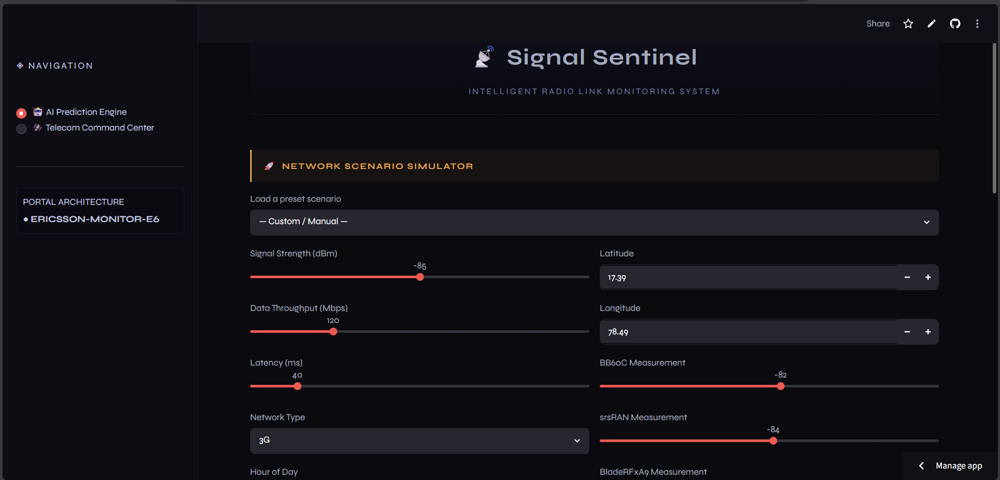
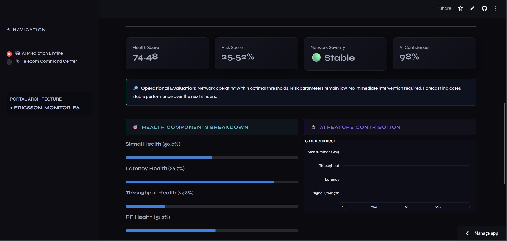
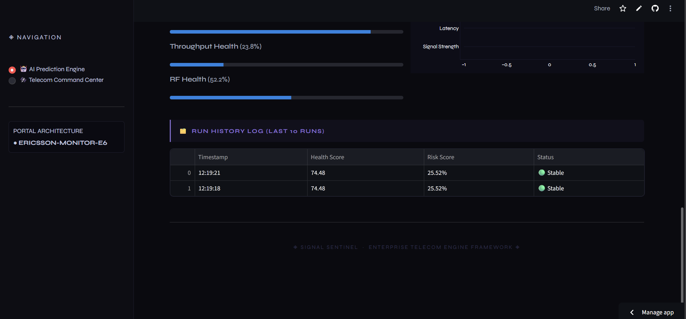
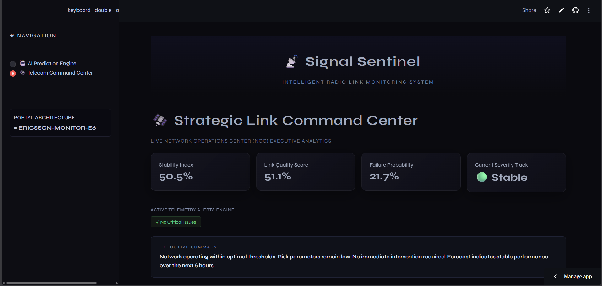
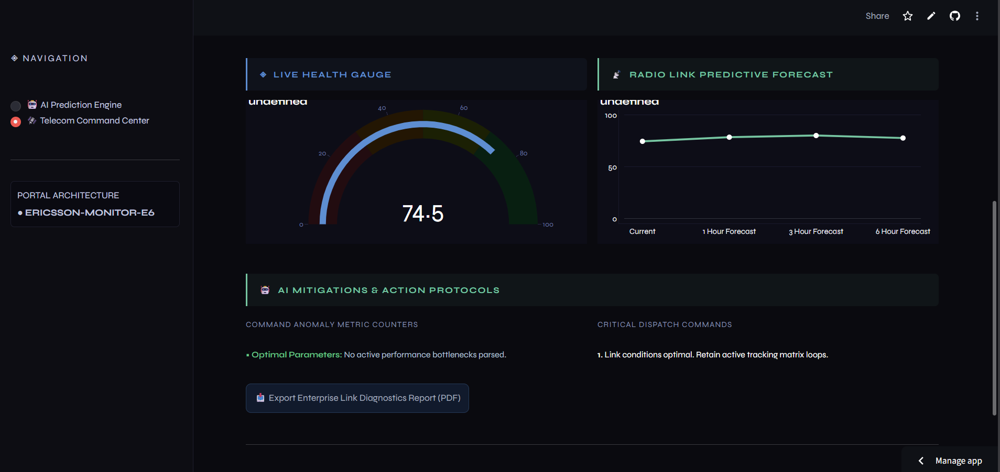

# 📡 Signal Sentinel

Signal Sentinel is a machine learning project developed to monitor radio link performance and predict network health.

The system uses telecom network parameters such as signal strength, throughput, latency, and radio measurements to generate a health score, identify possible issues, and provide recommendations for improving network performance.

## Live Demo

https://signal-sentinel-bcecpnwvhnfjbl8asdsmky.streamlit.app/

## Features

* Network Health Prediction
* Radio Link Degradation Detection
* Risk Score Analysis
* Root Cause Analysis
* AI Recommendations
* Network Health Forecasting
* Feature Importance Analysis
* Telecom Dashboard
* PDF Report Generation

## Screenshots

### Dashboard



### Prediction Results



### Health Analysis



### Command Center



### Forecast



## Technologies Used

* Python
* Streamlit
* Pandas
* NumPy
* Scikit-Learn
* XGBoost
* Plotly
* Joblib

## How to Run

Install the required packages:

```bash
pip install -r requirements.txt
```

Run the application:

```bash
streamlit run app.py
```

## GitHub Repository

https://github.com/SRUJAN1802/Signal-Sentinel

## Author

Srujan
